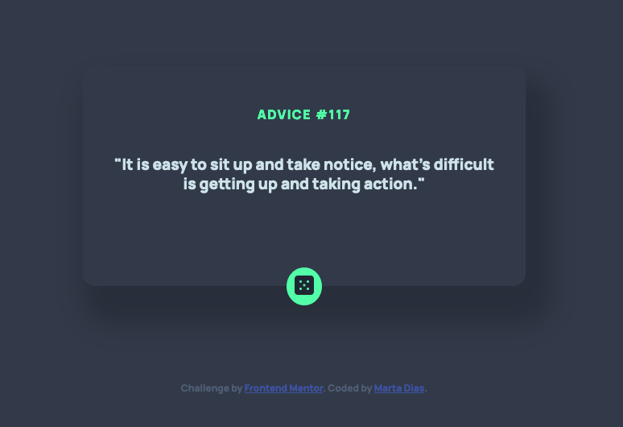
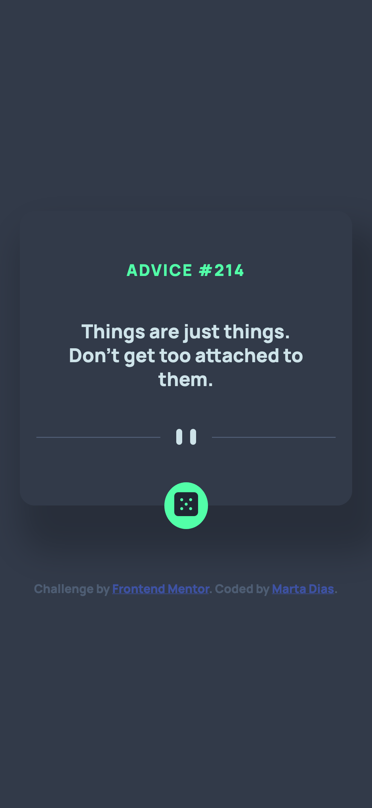

# Frontend Mentor - Advice generator app solution

This is a solution to the [Advice generator app challenge on Frontend Mentor](https://www.frontendmentor.io/challenges/advice-generator-app-QdUG-13db). Frontend Mentor challenges help you improve your coding skills by building realistic projects.

## Table of contents

- [Overview](#overview)
  - [The challenge](#the-challenge)
  - [Screenshot](#screenshot)
  - [Links](#links)
- [My process](#my-process)
  - [Built with](#built-with)
  - [What I learned](#what-i-learned)
  - [Continued development](#continued-development)
  - [Useful resources](#useful-resources)
- [Author](#author)
- [Acknowledgments](#acknowledgments)

## Overview

A great challenge to practice with APIs.

### The challenge

The users should be able to click the button and enjoy the advice of the day. Pressing the tab button on the keyboard will also focus the button.

### Screenshot

### Links

- Solution URL: (https://your-solution-url.com)
- Live Site URL: (https://your-live-site-url.com)

## My process

### Built with

- Semantic HTML5 markup
- CSS custom properties
- Flexbox
- CSS Grid
- JS

### What I learned

No doubt that I have a lot to pratice and learn, I have a lot of questions and struggles with positioning of elements, with that said I am very proud of what I have done.

### Useful resources

- [MDN](https://developer.mozilla.org/en-US/docs/Web/API/Fetch_API/Using_Fetch) - This helped me with the API.

## Author

- Website - [Marta Dias](ComingSoon)
- Frontend Mentor - [@MDias04](https://www.frontendmentor.io/profile/MDias04)
- Twitter - [@its_MDias](https://www.twitter.com/its_MDias)

## Acknowledgments

I would like to thank Matt and all the team involved in Frontend Mentor. These challenges do mean a lot to me. 🖖🏼
